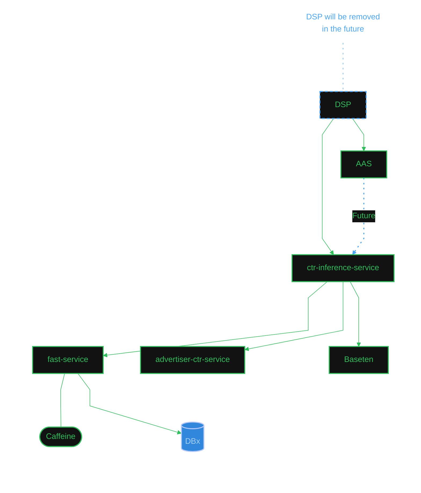

# CTR Discover / ctr-inference-service

Project map. Jira epic **AI-1140**. Slack **#proj-ctr-discover** (`C0B1Z59SBB3`), plus **#tmp-dsp-ctr-inference-service-adt** (`C0BLCSFTTH8`) for the DSP integration standup (15 min, Mon–Thu, set up by Neena 2026-07-29).

Not Varun's project. It is mapped here because it consumes `advertiser-ctr-service` (whose prod alerts land in `#prod-relevance-yield-alerts`) and because the DSP-to-AAS retargeting decision below is the same argument Dhaval is making on the pCIV side.

## Serving topology (Neena's diagram, 2026-08-03)

Source: Neena Sulakhe, `#proj-ctr-discover`, 2026-08-03 10:59:49 ET, message ts `1785769189.630719`, "high level diagram :" with `Screenshot 2026-08-03 at 10.59.07 AM.png` (file `F0BMKCH198V`). One 👍 as of 11:13. **This is Neena's drawing, not an independently verified topology.**

Mermaid below is **Varun's transcription** of that screenshot, supplied in-chat 2026-08-03. It supersedes an earlier ASCII version in this file that misread two things.

Read as: `ctr-inference-service` is the hub. It calls `advertiser-ctr-service`, `fast-service` and Baseten. `fast-service` holds a Caffeine cache and reads from Databricks.

**DSP is being removed, not just rerouted.** The annotation attaches to the DSP node itself and reads "DSP will be removed in the future", and DSP carries the deprecated style. Today DSP calls both AAS and `ctr-inference-service`; the dotted "Future" arrow has AAS calling `ctr-inference-service` instead.

That matches Dhaval on AI-1140's adjacent thread, `#proj-ctr-discover` 2026-07-29 19:46 ET: "In an ideal world, this data flows through from AAS to DSP. AAS knows which query path it took so it the most deterministic info." The diagram is the architecture that argument implies.

## Two open questions on the diagram

- **The solid arrow to Baseten may contradict a recorded decision.** `state/digest-2026-07-24.md` records, on AI-1370: "(Baseten ruled out for this service on latency SLA.)" Neena's diagram draws Baseten as a current dependency of `ctr-inference-service`, not a rejected one. Possible readings: the decision reversed, the earlier note was scoped to a narrower comparison, or the arrow means the embedding-model path rather than CTR inference. Baseten is certainly still live somewhere — **AI-1267** "CI/CD to deploy fine tuned embedding model to Baseten" moved Blocked → In Review on 2026-08-02. Worth one question to Neena or Rama before anyone cites the topology.
- **Whether `fast-service` is the Feature Store work is unconfirmed.** Its shape in the diagram is feature-store-shaped: a Caffeine cache in front of Databricks. Separately, `state/digest-2026-07-24.md` records AI-1370 as "Redis lag-features via **feast-store-library** working locally", Rama asked Steven Wu on 2026-07-20 for a "working Dev **Feature Store** API endpoint", and Steven filed **AI-1632** "Create Databricks Secrets Scope and Values for Feature Store - Stage" on 2026-08-03. Those may all be `fast-service` under a different name, or a separate component. The diagram shows Caffeine and Databricks and does not mention Redis, so do not merge the two records without asking.

## Contract and integration state (2026-08-03)

- **Owner split:** Rama Mukkamalla builds `ctr-inference-service`. Neena builds the `dsp-engine` integration. Stephen Ince owns the auction piece (**AS-13444**, "[dsp-engine] Enable new auction logic when experimenting with ctr-inference-service"). Lochan Mahajan has the QE work (**AS-12949**). Ankit Shah and Yaarit Even are the standing cc.
- **TDD:** `docs.google.com/document/d/1zK6yeqkAw6he2BoGgMQmKhjvDIYB95KIXRNxBnPupKI` — Neena added a field-mapping tab 2026-07-30 with open questions marked in red.
- **Neena is blocked on a shared library.** She asked Rama on 2026-07-28 for a `service-name-api-client`-convention jar carrying request, response and enum classes so `dsp-engine`, `ctr-inference-service` and the QE repo stay on one contract shape. Rama's ETA was 8/3. As of 7/31 11:56 she still needed it plus a sample curl for the new endpoint, and Saksham escalated on 7/31 11:22: "please prioritize this because AS changes are the long pole and will be the last thing which will be completed".
- **Response shape changes from R&Y's contract** (Neena, 2026-07-28): adds `requestId`, `productId`, `keywordId`; renames `advertiserCtrList` to `predictions`; moves `ctr` and `type` into a nested prediction object. No fields dropped.
- **`type` enum** is `ELME`, `LEGACY`, `CTR_INFERENCE`.
- **Ad type resolution is unsettled in a small way.** DSP sets `AdType` TEXT for tile ads too. Ankit's plan (7/30 16:34) is to pass it through unchanged and let the service ignore it, since the default Find flow does not need it. Rama confirmed Find tiles carry no experiment context.
- **Experimentation:** Yaarit asked Munjal Thakkar on 2026-07-29 for an Amplify config type named "Use CTR Realtime for Yield Auction", a simple enable/disable toggle, to A/B test the query-aware CTR model on non-caching Discover placements.

## Why this gates Vespa work

Neena, `#release-6129-vespa-group-topology` 2026-07-28: us-east moves to group topology only **after** the DSP-to-`ctr-inference-service` work completes, which she estimated at roughly end of the following week, later given as ~8/7. That sequencing is what Oren's Monday traffic shift and the AI-1386 rollout plan sit on top of.

## Related

- `map/aas.md` — the future caller.
- `map/vespa.md` — AI-1386 grouped topology, sequenced behind this work.
- `state/digest-2026-07-24.md` — AI-1370 status, the Baseten note above.
